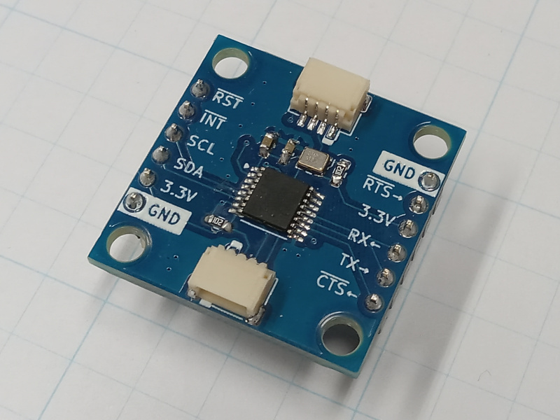
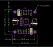
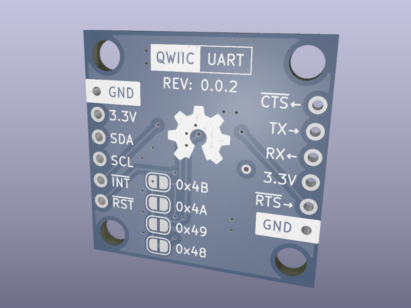

# QwiicUART Board

Have you ever needed another Serial (UART) port, but your microcontroller doesn't have any more.
This board allows you to add up to four Serial ports via the Qwiic system.

This is a breakout board for the NXP SC16IS741A.
The SC16IS741A is a UART controlled using an I2C or SPI interface.
This board is only setup to be able to utilize the I2C interface.

> [!NOTE]
> This design is distributed WITHOUT ANY EXPRESS OR IMPLIED WARRANTY, INCLUDING OF MERCHANTABILITY, SATISFACTORY QUALITY AND FITNESS FOR A PARTICULAR PURPOSE.

> [!WARNING]
> Applying voltages higher than 3.3V to any I/O pin could damage the board.

### Documentation
- [Schematic](QwiicUART-Board.pdf)
- [KiCad Source Files](src)
- [QwiicUART Library](https://github.com/CMB27/QwiicUART-Library)
- [SparkFun Qwiic Landing Page](https://www.sparkfun.com/qwiic)
- [NXP SC16IS741A Datasheet](https://www.nxp.com/docs/en/data-sheet/SC16IS741A.pdf)

## Components

### Circuit Board Specifications
- Board Length: **25.4 mm**
- Board Width: **25.4 mm**
- Board Thickness: **1.6 mm**
- Substrate Material: **FR4**
- Copper Layers: **2**
- Copper Thickness: **1 oz**
- Soldermask Color: **Any** (Blue Suggested)
- Surface Finish: **Any** (HASL Lead-Free Suggested)
- Smallest Hole Diameter: **0.3 mm [11.8 mil]**
- Smallest Trace Width: **0.2 mm [7.8 mil]**
- Smallest Trace Spacing: **0.2 mm [7.8 mil]**

### Purchase Components
| References | Quantity | Manufacturer | Part Number            | Description           |
| :--------- | :------: | :----------- | :--------------------- | :-------------------- |
| C1, C2     |        2 | Samsung      | CL10B104KB8NNWC        | 0.1uF 0603 Capacitor  |
| J1, J2     |        2 | JST          | SM04B-SRSS-TB(LF)(SN)  | 4-Position Connector  |
| R1, R2     |        2 | YAGEO        | RC0603JR-071KL         | 1K Ohm 0603 Resistor  |
| U1         |        1 | NXP          | SC16IS741AIPWJ         | UART IC               |
| X1         |        1 | ECS          | ECS-2520MVLC-018-BN-TR | 1.8432 HMz Oscillator |

## Assembly

All components are assembled to the top side of the board.
See the image above for component locations.

On the back side of the board there are several solder jumper locations.
By default the lower `0x48` jumper is connected.
This connection can be cut and another jumper can be soldered to change the I2C address.

> [!WARNING]
> Powering up the board with more than one jumper soldered/connected could result in a short ciruit damaging the board.
